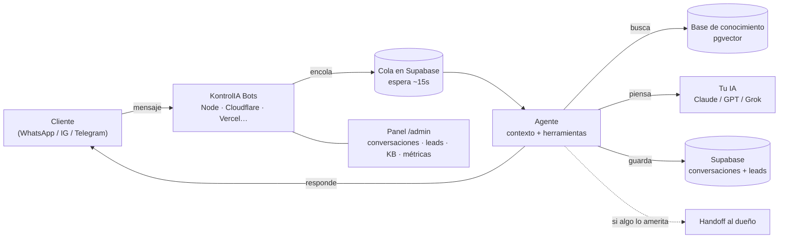

<div align="center">

# 🔨 KontrolIA Bots

### Tu chatbot de IA para WhatsApp, Instagram y Telegram — en **tu propia nube**, gratis y open source.

**Atiende a tus clientes 24/7, responde desde tu base de conocimiento, y te avisa a ti cuando algo lo amerita.** Vive donde tú digas —tu computadora, Cloudflare, Vercel, Netlify o tu propio servidor—, con tu base de datos y tu llave de IA. Tus datos son tuyos. Sin mensualidades de SaaS.

<em>Self-hosted, open-source AI support bot for small businesses. Runs on Node, Docker, Cloudflare, Vercel or Netlify. Your Supabase, your AI key. Spanish-first. Deploy in minutes.</em>

[](./LICENSE)
[](./docs/despliegue.md)
[](https://supabase.com/)
[](https://horizontesia.com)

[**Instalar**](#-instalar-en-5-minutos) · [**Cómo funciona**](#-cómo-funciona) · [**KontrolIA Bots+**](#-kontrolia-bots--los-14-giros-y-el-modo-agencia) · [**Comunidad**](https://horizontesia.com)

</div>

---

## ¿Qué es KontrolIA Bots?

Un asistente de soporte con IA que montas **en tu propia infraestructura** en una tarde — sin saber programar. En lugar de pagar una mensualidad a un SaaS que se queda con tus conversaciones, KontrolIA Bots vive donde tú elijas, con tu base de datos y tu llave de IA, y **todo es tuyo**.

- 💬 **Multicanal** — WhatsApp, Instagram, Messenger y Telegram desde un mismo cerebro.
- 📚 **Aprende de tus documentos** — subes tus FAQ, políticas y guías; el bot busca ahí antes de responder (RAG con base vectorial).
- 🎙️ **Entiende notas de voz** — transcribe los audios de tus clientes automáticamente.
- 🙋 **Sabe cuándo pedir ayuda** — si algo es delicado o no está seguro, te hace *handoff* a ti.
- 📊 **Panel de administración** — conversaciones, leads, base de conocimiento y métricas, todo en `/admin`.
- ☁️ **Despliégalo donde quieras** — tu computadora, Docker, Cloudflare, Vercel o Netlify. El mismo código.
- 🧠 **Tu cerebro, tu llave** — Claude, ChatGPT o Grok; tú eliges y pagas solo lo que piensa.

> **No necesitas saber programar.** KontrolIA Bots se instala y configura con [Claude Code](https://claude.com/claude-code) como tu copiloto — él corre los comandos por ti, paso a paso.

---

## 🚀 Instalar en 5 minutos

### Opción A — con Claude Code (recomendado, no necesitas saber programar)

Abre [Claude Code](https://claude.com/claude-code) en tu terminal y dile:

```
ármame un chatbot con KontrolIA Bots
```

Claude te explica cómo funciona y cuánto cuesta, verifica que tengas lo necesario, y monta todo por ti: crea tu Cloudflare, despliega el bot y te entrega tu panel vivo. Por debajo corre:

```bash
npx forjabot init
```

### Opción B — manual (si ya programas)

Crea una [Supabase](https://supabase.com) gratis, copia su cadena de conexión, y:

```bash
git clone https://github.com/santmun/forja mi-chatbot
cd mi-chatbot
npm install
cp .env.example .env        # pon ahí DATABASE_URL y tu llave de IA
npm run db:apply            # crea las tablas
npm start                   # ¡listo!
```

Tu panel queda en `http://localhost:8787/admin`.

Para publicarlo en Cloudflare, Vercel, Netlify o tu propio servidor: **[docs/despliegue.md](./docs/despliegue.md)**.

---

## 💸 Cuánto cuesta

KontrolIA Bots es **gratis y open source**. Lo único que pagas es tu propia infraestructura, y arranca casi en cero:

| Pieza | Costo | Notas |
|---|---|---|
| **Base de datos** (Supabase) | **$0** para empezar · ~$25/mes si creces mucho | El plan gratis aguanta un negocio normal de sobra |
| **La casa del bot** | **$0–5/mes** | Cloudflare y Vercel tienen capa gratis; en tu propia máquina, gratis |
| **Cerebro de IA** (tu llave) | ~**$1–2/mes** para un negocio normal | Pagas solo lo que el bot piensa |

Nadie más toca tus datos ni tus conversaciones.

---

## 🧠 Cómo funciona



Un mensaje entra por un canal → **el bot espera unos segundos por si sigues escribiendo** y junta todo en una sola pregunta → arma contexto desde tu base de conocimiento → tu IA redacta la respuesta con la voz de tu negocio → se responde y se guarda. Si algo es delicado, te avisa a ti.

---

## 🧩 Stack

- **[Hono](https://hono.dev/)** — el runtime, portable a Node, workerd, Vercel y Netlify.
- **[Vercel AI SDK](https://sdk.vercel.ai/)** — capa de LLM (Anthropic / OpenAI / xAI, con llave propia).
- **[Supabase](https://supabase.com/)** (Postgres) — conversaciones, leads, configuración **y** la cola del agente.
- **pgvector** — base de conocimiento / RAG, en la misma base.
- Embeddings y transcripción de voz con proveedor intercambiable (Workers AI en Cloudflare, OpenAI fuera).

Un solo código para los cinco destinos. Cómo desplegar en cada uno: **[docs/despliegue.md](./docs/despliegue.md)**.

---

## ⭐ KontrolIA Bots+ — los 14 giros y el Modo Agencia

El Starter de este repo sirve para **cualquier negocio**. Si quieres ir más allá, **KontrolIA Bots+** (con la comunidad de [Horizontes IA](https://horizontesia.com)) desbloquea:

- 🎯 **14 giros con panel a la medida** — barbería, restaurante, inmobiliaria, clínica, spa, gimnasio, hotelería y más, cada uno con sus herramientas (reservaciones, agenda, calificar prospectos…).
- 🤖 **Comandos que trabajan por ti** — `/mantenimiento`, `/campaña`, `/afinar`, `/clonar` (arma tu KB desde tu web), `/precios`…
- 💼 **Modo Agencia** — arma y **revende** bots a otros negocios, con cotizador y propuesta incluidos.
- 👥 **Comunidad + soporte** — 600+ personas construyendo con IA en español, y actualizaciones gestionadas.

👉 **[Únete a Horizontes IA →](https://horizontesia.com)**

---

## 🔒 Privacidad — quién ve los datos

**Nadie más que tú.** KontrolIA Bots corre en TU cuenta de Cloudflare con TUS llaves: las conversaciones de tus clientes viven en tu base de datos y **el bot no envía telemetría ni datos de uso a Horizontes IA ni a nadie**. No hay ping de activación ni analíticas ocultas — puedes revisarlo tú mismo en `src/`.

- Los **mensajes se borran solos a los 90 días** (cron diario). Los leads y tickets se quedan hasta que tú los borres.
- **No se guardan audios ni imágenes**: se transcriben o describen y solo queda el texto.
- Los links del bot cuentan clics, **sin IP ni navegador**.
- El texto de la conversación sí viaja al **proveedor de IA que tú elegiste** (con tu llave) para poder responder.
- Si preguntan si es un bot, **el bot lo admite**. No lo configures para negarlo.

Como dueño del negocio, **tú eres el responsable** de esos datos: avisa a tus clientes que la atención es automatizada y que guardas la conversación, y atiende las solicitudes de borrado. Todo el detalle está en [`PRIVACY.md`](./PRIVACY.md).

---

## 🤝 Contribuir

Los PRs son bienvenidos. Lee [`CONTRIBUTING.md`](./CONTRIBUTING.md) para el flujo, y abre un issue si tienes una idea o encuentras un bug. Este repo es el **Starter** open source; los giros y comandos de KontrolIA Bots+ viven aparte.

## 📄 Licencia

[MIT](./LICENSE) © Horizontes IA. Úsalo, modifícalo y móntalo para quien quieras.

<div align="center">

**Hecho con 🔨 por [Horizontes IA](https://horizontesia.com)** · [YouTube](https://youtube.com/@horizontesia) · [Comunidad](https://horizontesia.com)

</div>
